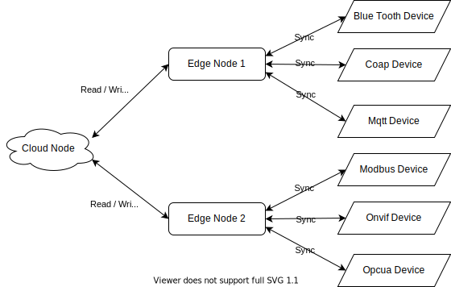

# KubeEdge Mqtt and Coap Mappers

Kubeedge is an IOT technology to apply kubernetes to industry. as we know kubernetes is docker cluster, but mostly used for website oeration. In industry area, need server to control and monitor all devices. Kubeedge assign the server job to kubernetes network, which greatly improve the monitored device amount. Kubeedge is still a new technology and in development, but I think highly of this technology.

This repository contains mappers to illustrate possible use cases of [KubeEdge](https://github.com/kubeedge/kubeedge) platform. Original [KubeEdge Mapper](https://github.com/kubeedge/mappers-go) do not support Mqtt direct connection and Coap protocol. So I write Mqtt direct and Coap mappers for our project usuage.

## Workflow

All mappers is used to synchronize data from device to cloud

## Kubeedge IOT Mapper
Please click below 2 mapper name to view detailed deployment steps

|Name | Description |
|---|---|
|  [Mqtt](./mappers-go/mappers/direct/README.md)     | Mapper for device direct connect to edge node with mqtt protocol
|[Coap](./mappers-go/mappers/coap/README.md) | Mapper for device connect to edge node with coap protocol

## Mqtt vs coap
Please click [here](./mappers-go/MQTT%20and%20CoAP.md) to view comparison of Mqtt and Coap

## License

KubeEdge Mapper is under the Apache 2.0 license. See the [LICENSE](LICENSE) file for details..