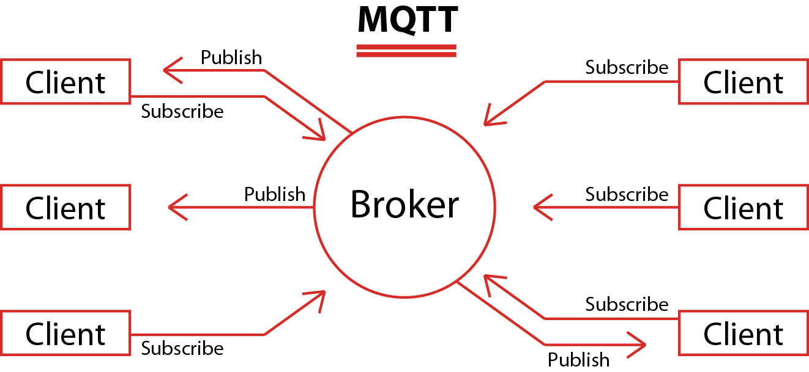
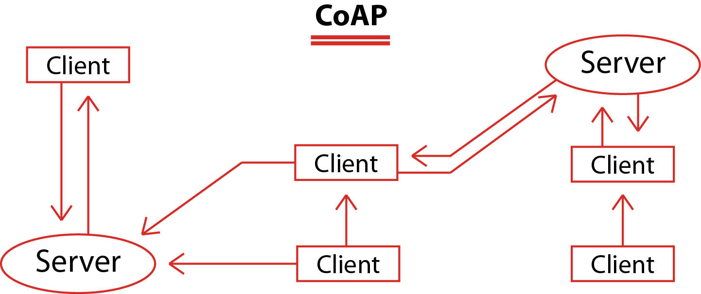

## Comparison

MQTT and CoAP are both useful as IoT protocols, but have fundamental differences.

MQTT is a many-to-many communication protocol for passing messages between multiple clients through a central broker. It decouples producer and consumer by letting clients publish and having the broker decide where to route and copy messages. While MQTT has some support for persistence, it does best as a communications bus for live data.

CoAP is, primarily, a one-to-one protocol for transferring state information between client and server. While it has support for observing resources, CoAP is best suited to a state transfer model, not purely event based.

MQTT clients make a long-lived outgoing TCP connection to a broker. This usually presents no problem for devices behind NAT. CoAP clients and servers both send and receive UDP packets. In NAT environments, tunnelling or port forwarding can be used to allow CoAP, or devices may first initiate a connection to the head-end as in LWM2M.

MQTT provides no support for labelling messages with types or other metadata to help clients understand it. MQTT messages can be used for any purpose, but all clients must know the message formats up-front to allow communication. CoAP, conversely, provides inbuilt support for content negotiation and discovery allowing devices to probe each other to find ways of exchanging data.

Both protocols have pros and cons, choosing the right one depends on your application.

## MQTT

Message Queue Telemetry Transport (MQTT), is a publish-subscribe protocol that facilitates one-to-many communication mediated by brokers. Clients can publish messages to a broker and/or subscribe to a broker to receive certain messages. Messages are organized by topics, which essentially are “labels” that act as a system for dispatching messages to subscribers.

 

 ## CoAP

Constrained Application Protocol (CoAP), is a client-server protocol that, unlike MQTT, is not yet standardized. With CoAP, a client node can command another node by sending a CoAP packet. The CoAP server will interpret it, extract the payload, and decide what to do depending on its logic. The server does not necessarily have to acknowledge the request.

 

 
The following table compares different features and shows the strengths and debilities of each protocol:

 |  Features   | MQTT  | COAP |
|  ----  | ----  | ---- |
| Base protocol  | TCP | UDP |
| Model used for communication  | Publish-Subscribe | Request-Response Publish-Subscribe |
| Communication node | M:N	| 1:1 |
 Power consumption | Higher than CoAP | Lower than MQTT
 RESTful | No | Yes
 Number of messages type used | 16 | 4
 Header size | 2 Bytes | 4 Bytes
 Messaging | Asynchronous | Asynchronous & Synchronous
 Reliability | 3 Quality of service levels  QoS 0: Delivery not guaranteed  QoS 1: Delivery confirmation  QoS 2: Delivery double confirmation | Confirmable messages   Non-confirmable messages Aknowledgements   Retransmissions<
 Implementation | Easy to implement   Hard to add extensions	| Few existing libraries and support
 Security | Not defined   Can use TLS/SSL | DTLS or IPSec
 Other | Useful for connections with remote location   No error-handling	| Low overhead   Low latency   NAT issues